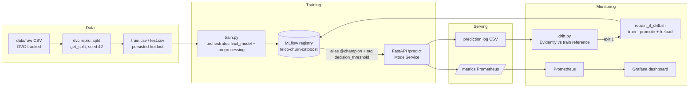

# Telco Customer Churn — Data Science + MLOps (local stack)

Dự đoán khách hàng rời bỏ dịch vụ viễn thông (Telco Customer Churn, IBM/Kaggle) — làm trọn vòng đời một bài
toán ML: từ đặt vấn đề business, EDA, modeling, đánh giá trung thực trên holdout, giải thích được model, đến
một MLOps stack chạy được bằng một lệnh `docker compose up`. Mở rộng thêm một phân tích survival analysis
(thời điểm khách rời đi, không chỉ có/không).

## Tóm tắt kết quả

- **Model**: CatBoost, tune bằng Optuna (TPE, 25 trial/model, so công bằng với Logistic Regression/LightGBM/
  XGBoost) — **PR-AUC 0.6365** trên holdout (test set 1055 khách, chưa từng được model nhìn thấy trước đó),
  ROC-AUC 0.8369.
- **Decision threshold 0.465**: không phải 0.5 mặc định, cũng không phải điểm tối ưu F2 (0.295) — chọn bằng
  giá trị kỳ vọng tính ra tiền (chi phí ưu đãi giữ chân so với doanh thu giữ được), có kiểm tra sensitivity
  qua nhiều giả định. Trên test set, model tạo thêm **$38,290** giá trị so với không làm gì.
- **Driver churn chính**: `tenure`, loại hợp đồng (`Contract`), `InternetService`, thiếu `TechSupport`/
  `OnlineSecurity` — xác nhận chéo bằng 4 phương pháp giải thích độc lập (feature importance, SHAP,
  Permutation Importance, LIME).
- **Mở rộng — Survival analysis**: mô hình Cox PH (concordance 0.8663) cho biết thêm *khi nào* khách có khả
  năng rời đi, không chỉ *có hay không* — khách hợp đồng month-to-month có rủi ro tập trung mạnh nhất ở vài
  tháng đầu.
- **MLOps**: training tái lập được (deterministic, đã verify chạy 2 lần ra cùng số liệu), MLflow registry với
  alias `@champion`, FastAPI serving đọc threshold từ registry tag, DVC data versioning, Evidently drift
  monitoring với vòng retrain tự động + hot-reload, Prometheus + Grafana, CI (lint + test matrix Python
  3.12/3.14 + docker-build).

**Toàn bộ số liệu ở trên lấy trực tiếp từ output đã chạy của notebook — chi tiết + bằng chứng đầy đủ xem
[`docs/research_report.md`](docs/research_report.md).**

## Bài toán & dữ liệu

Dataset: [Telco Customer Churn](https://www.kaggle.com/datasets/blastchar/telco-customer-churn) (IBM/Kaggle),
7043 khách hàng × 21 cột, 1 dòng = 1 khách hàng tại 1 thời điểm snapshot (không có chiều thời gian lặp lại).
Target imbalance 73.4% No / 26.6% Yes — baseline "luôn đoán No" đạt 73.4% accuracy nhưng bỏ sót 100% khách
churn thật, nên **accuracy và ROC-AUC bị loại khỏi vai trò primary metric**; PR-AUC (chọn model) và F2/giá trị
kỳ vọng bằng tiền (chọn threshold) được dùng thay thế — lý do đầy đủ ở `docs/docs.md` Pha 1.

## Cách tiếp cận

Theo khung **CRISP-ML(Q)**, mỗi pha chỉ được ghi vào tài liệu sau khi đã chốt (không viết trước nội dung
chưa làm):

1. **Business & Data Understanding** — cost matrix, primary metric, data hygiene (EDA phát hiện `TotalCharges`
   bị ẩn dưới dạng chuỗi, đúng 11 dòng khách mới chưa có billing cycle).
2. **Data Preparation** — holdout 15% tách riêng khỏi CV ngay từ đầu và persist ra đĩa (chống selection bias),
   `StratifiedKFold(5)` cho train pool, preprocessing pipeline chống leakage.
3. **Modeling** — baseline no-skill → 4 model tay chọn → regularize thủ công → Optuna TPE tune công bằng cả
   4 họ model, luôn theo dõi song song `overfit_gap` chứ không chỉ điểm CV.
4. **Evaluation** — chạm `test_df` đúng 1 lần, đối chiếu CV vs holdout trung thực (kể cả khi lệch), error
   analysis phân loại lỗi theo ý nghĩa (near-miss vs confident-miss), không chỉ đếm số.
5. **Business Value & Explainability** — threshold theo giá trị kỳ vọng thay vì F-score trừu tượng, 4 phương
   pháp XAI độc lập đối chiếu chéo, giải thích được từng dự đoán sai cụ thể.
6. **Mở rộng — Survival analysis** — cùng dataset, đặt câu hỏi khác (*khi nào* thay vì *có/không*), so sánh
   Kaplan-Meier/parametric/Cox PH, chọn model dựa trên bằng chứng thực nghiệm chứ không theo khuyến nghị sách
   vở một cách máy móc (xem phần "Model chọn" trong `docs/research_report.md`).
7. **MLOps** — production hoá pipeline đã chốt: MLflow registry, FastAPI serving, DVC, drift monitoring +
   retrain tự động, Prometheus/Grafana, containerize toàn bộ bằng Docker Compose.

## Kiến trúc MLOps



## Cấu trúc

| Đường dẫn | Nội dung |
|---|---|
| `notebooks/churn_classification/` | 5 notebook CRISP-ML(Q): EDA → data prep → modeling → evaluation → business value & XAI |
| `notebooks/survival_analysis/` | Mở rộng: time-to-churn (Kaplan-Meier, Cox PH) — bổ sung "khi nào" cho model classification "có/không" |
| `src/` | Module tái sử dụng: data loading, preprocessing, persisted split, final model, `train.py`, serving, monitoring, `survival_analysis/` (Cox PH) |
| `configs/` | `train.yaml` (MLflow, threshold), `monitoring.yaml` (drift) |
| `tests/` + `.github/workflows/` | pytest (fixtures synthetic, không cần data thật) + CI matrix Python 3.12/3.14 |
| `docker/` + `docker-compose.yml` | mlflow, api, prometheus, grafana |
| `docs/docs.md` | Log quyết định data science theo từng pha (quyết định + lý do + trade-off) |
| `docs/research_report.md` | Báo cáo kết quả + insight (số liệu và phát hiện, không lặp lại lý do) |
| `docs/mlops.md` | Kiến trúc MLOps, runbook, design decisions, integration gotchas |
| `docs/survival_analysis_theory.md` | Lý thuyết survival analysis (duration, censoring, hazard, KM/Cox) |

## Chạy nhanh

```bash
make setup                 # uv sync --all-groups (cần uv + Python 3.12)
make download-data         # tải data/WA_Fn-UseC_-Telco-Customer-Churn.csv từ Kaggle (kagglehub, không cần API key)
docker compose up -d mlflow
MLFLOW_TRACKING_URI=http://127.0.0.1:5000 make train-promote
docker compose up -d --build
curl localhost:8000/docs   # API; Grafana :3000, MLflow :5000, Prometheus :9090
```

`uv run dvc pull` **chỉ dùng được nếu bạn tự cấu hình remote DVC của riêng mình** — `.dvc/config` trong repo
trỏ về một remote kiểu `local` (đường dẫn tuyệt đối trên máy tác giả), không phải remote chia sẻ được.
`make download-data` là cách lấy data đúng cho một checkout mới; sau đó `dvc repro`/`make train-promote` tự
tạo lại `data/processed/` từ file CSV đó.

Toàn bộ lệnh vận hành (train, drift check, retrain hook, ...) xem runbook trong [`docs/mlops.md`](docs/mlops.md).

## Vòng monitoring → retrain

Serving log mỗi request vào `prediction-logs/`; `make check-drift` so phân phối feature với train reference
(Evidently), exit 1 khi >30% cột drift; `make retrain-if-drift` nối tiếp: retrain → promote `@champion` mới →
`POST /reload` để API hot-swap không cần restart.

## Tech stack

Python 3.12 (uv, ruff, pytest) · scikit-learn + CatBoost/LightGBM/XGBoost (candidate models) + Optuna (tune)
· SHAP/LIME/scikit-inspection (explainability) · lifelines (survival analysis) · MLflow (tracking + registry)
· FastAPI + Pydantic (serving) · DVC (data/pipeline versioning) · Evidently (drift) · Prometheus + Grafana
(monitoring) · Docker Compose (containerize) · GitHub Actions (CI).
