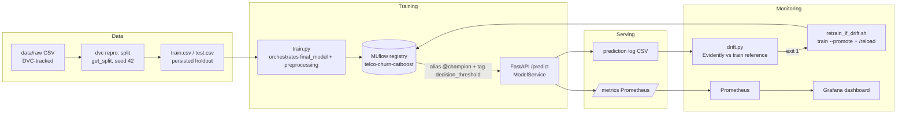

# MLOps — Telco Churn (local stack)

Tài liệu vận hành cho phần MLOps của project. Phần data science (CRISP-ML(Q), 5 notebooks) xem `docs/docs.md`.

## Kiến trúc

## Threshold provenance

Decision threshold **0.465** — không phải 0.5:

1. **Notebook 05 (Part A)**: chọn bằng argmax expected retention value (tính bằng tiền) trên OOF predictions của train pool — thắng cả 0.5 default lẫn F2-optimal 0.295.
2. **`configs/train.yaml`** (`decision_threshold: 0.465`): source of truth cho mỗi lần train.
3. **Registry tag**: `train.py` stamp threshold lên model version lúc register.
4. **Serving**: `ModelService` đọc theo thứ tự ưu tiên `DECISION_THRESHOLD` env > registry tag > 0.5 fallback — API trả về threshold đang dùng trong mỗi response.

## Các quyết định kiến trúc

**Feature store (Feast): KHÔNG dùng.** Feature store giải quyết online/offline skew, point-in-time-correct joins trên nhiều bảng nguồn, và chia sẻ feature giữa nhiều team/model. Project này có một bảng CSV tĩnh, một model, một consumer, và mọi transform nằm trong sklearn `ColumnTransformer` được ship *bên trong* model artifact — train/serve parity (đúng vấn đề feature store sinh ra để giải quyết) đã được pipeline đảm bảo sẵn. Thêm Feast chỉ thêm hạ tầng, không giải quyết vấn đề nào đang tồn tại.

**Prometheus + Grafana: CÓ.** Evidently cover chiều *data* (phân phối feature vào model); Prometheus cover chiều *serving* (latency, RPS, và phân phối *score* đầu ra qua histogram `churn_prediction_probability`). Hai chiều bổ sung nhau — score distribution dịch chuyển trên Grafana là tín hiệu sớm ngay cả khi feature drift chưa vượt ngưỡng.

**MLflow alias thay vì stage.** Model stages đã deprecated từ MLflow 2.9; promote bằng alias `@champion`, serving resolve `models:/telco-churn-catboost@champion` nên retrain+promote không cần restart API (đã có `POST /reload`).

## Runbook

| Lệnh | Tác dụng |
|---|---|
| `make setup` | `uv sync --all-groups` |
| `make lint` / `make fmt` / `make test` / `make cov` | ruff / pytest |
| `make train` | Train + log MLflow (không promote) |
| `make train-promote` | Train + gán alias `@champion` cho version mới |
| `make mlflow-ui` | MLflow UI trên sqlite local (port 5000) |
| `make serve` | uvicorn local (cần `MLFLOW_TRACKING_URI`) |
| `make compose-up` | mlflow + api + prometheus + grafana (ports 5000/8000/9090/3000) |
| `make check-drift` | Drift check; exit 1 nếu >30% cột drift |
| `make simulate-drift` | Bắn traffic drift giả vào API (demo) |
| `make retrain-if-drift` | check → retrain+promote → `/reload` nếu drift |
| `uv run dvc repro` | Chạy lại pipeline split→train nếu deps đổi |
| `uv run dvc pull` | Khôi phục data từ DVC remote (`~/dvc-remote/telco-churn`) |

Quy trình chuẩn từ zero: `make setup` → `uv run dvc pull` → `make train-promote` → `make compose-up` (train lại với `MLFLOW_TRACKING_URI=http://127.0.0.1:5000` để registry nằm trong container mlflow) → curl `localhost:8000/predict`.

Lưu ý vòng retrain: `retrain_if_drift.sh` là manual-trigger có chủ đích — trong production thì lịch chạy (cron/Airflow) + alerting sẽ thay thế, và "retrain ngay khi drift" thường cần người duyệt vì drift có thể do lỗi upstream data chứ không phải thay đổi hành vi khách hàng thật.

## Bẫy tích hợp đã gặp (và cách đã xử lý)

Ghi lại vì đây là những lỗi **chỉ lộ ra khi chạy trong Docker**, local không thấy:

1. **Tracking URI: env var phải thắng config.** Ban đầu `train.py` set `mlflow.set_tracking_uri(cfg[...])` — nghĩa là `MLFLOW_TRACKING_URI=http://127.0.0.1:5000 make train-promote` bị config âm thầm redirect về sqlite local, model không bao giờ tới registry trong container (API load ra rỗng). Đã sửa: env var được ưu tiên, config chỉ là fallback.
2. **`skops` phải nằm trong group `serve`.** mlflow≥3 serialize sklearn model bằng skops, nhưng `mlflow-skinny` (dùng trong image serving cho nhẹ) không kéo skops theo — container crash `ModuleNotFoundError` ngay lúc load model dù local (cài mlflow full) chạy bình thường. Bài học: image tối giản phải được test load-model thật, không suy ra từ local.

## Trạng thái verified (2026-07-18)

Toàn bộ stack đã chạy và kiểm chứng end-to-end trên Docker compose:

- [x] `make setup` / lint / format / pre-commit / 24 pytest — xanh
- [x] `make train-promote` — holdout PR-AUC 0.6365 / ROC-AUC 0.8369, **khớp chính xác notebook 04**; chạy 2 lần metrics giống hệt (deterministic)
- [x] `dvc repro` idempotent, `dvc pull` khôi phục data đã xóa, metrics qua `dvc metrics show`
- [x] Compose 4 services up: mlflow (5000), api (8000), prometheus (9090), grafana (3000)
- [x] API load `@champion` từ registry container, threshold 0.465 từ tag; high-risk → 0.906/churn, low-risk → 0.019/không
- [x] Prometheus target `churn-api` up, scrape histogram `churn_prediction_probability`; Grafana dashboard 3 panels provisioned
- [x] Vòng tự động hoàn chỉnh trên Docker: simulate drift → check phát hiện (drifted_share 0.42 > 0.3) → retrain → promote v2 `@champion` → `POST /reload` → API serve v2 không cần restart
- [x] GitHub Actions CI trên branch `mlops` (lint + test matrix 3.12/3.14 + docker-build)

## Tương thích Python 3.14 (ghi nhận thực tế khi build)

- `shap` → `numba`/`llvmlite`: **chưa có wheel 3.14** — đây là lý do `.python-version` pin 3.12 và Docker image dùng `python:3.12-slim`. `optuna`/`shap` được chuyển vào group `notebooks` để các group còn lại cài được trên 3.14 (CI matrix 3.12 + 3.14 làm canary).
- Resolver lưu ý: không có floor version, uv từng backtrack về `mlflow 1.27` + `numba 0.53` (metadata cũ không khai numpy cap) — vì vậy `pyproject.toml` có `mlflow>=3`, `numba>=0.60`.
- `mlflow>=3` serialize sklearn model bằng **skops**: phải khai `skops_trusted_types` cho `catboost.core.CatBoostClassifier` khi `log_model` (đã làm trong `train.py`).
- `evidently` pin `>=0.7,<0.8` — API đổi mạnh giữa các major (code dùng API 0.7: `Report([DataDriftPreset()]).run(...)`).
